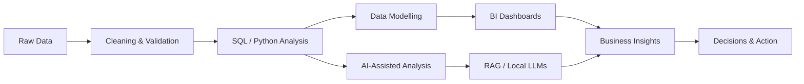

<!-- Profile README for Zhrasa -->

  

  
  
  

 

## Hi, I'm Zahra 👋

I’m a **Data Analyst** and **Business Intelligence Analyst** who turns complex, messy data into clear dashboards, practical insights, and decision-ready stories.

I work across **SQL, Python, Power BI, Tableau, Excel, DAX, ETL pipelines, data modelling, and business reporting**. My focus is building analytics systems that help teams understand performance, improve operations, and make faster, more confident decisions.

I’m also exploring **self-hosted AI workflows** for analytics projects — including local LLMs, RAG pipelines, AI-assisted reporting, document intelligence, and automation systems that keep data private and controllable.

 

---

## 🚀 What I Do

<table>
  <tr>
    <td width="50%">
      <h3>📊 Business Intelligence</h3>
      

        KPI dashboards, executive reporting, data visualisation, stakeholder insights,
        operational reporting, and commercial analysis.
      

    </td>
    <td width="50%">
      <h3>🧩 Data Analytics</h3>
      

        SQL analysis, Python workflows, data cleaning, validation, modelling,
        segmentation, trend analysis, and storytelling with data.
      

    </td>
  </tr>
  <tr>
    <td width="50%">
      <h3>⚙️ Data Engineering</h3>
      

        ETL pipelines, automated reporting, data quality checks, database querying,
        repeatable analytics workflows, and process improvement.
      

    </td>
    <td width="50%">
      <h3>🤖 Self-Hosted AI</h3>
      

        Local AI tools, private LLM workflows, RAG experiments, vector search,
        AI automation, and analytics copilots for business use cases.
      

    </td>
  </tr>
</table>

---

## 🧠 Core Skill Stack

  

### 📊 Data Analysis & BI

  
  
  
  
  

### 🛠 BI Tools

  
  
  
  

### 🗄 Databases & Querying

  
  
  
  

### 🐍 Programming & Analytics

  
  
  
  
  

---

## 🤖 Self-Hosted AI Stack

I use and experiment with private, local-first AI tools to support analytics, reporting, automation, and knowledge workflows.

### 🧩 Local LLMs & Model Runners

  
  
  
  
  

### 🧠 Open-Weight Models I Explore

  
  
  
  
  

### 🔎 RAG, Vector Search & AI Apps

  
  
  
  
  

### ⚡ Automation & Deployment

  
  
  
  

---

## 🧭 Analytics Workflow

 
